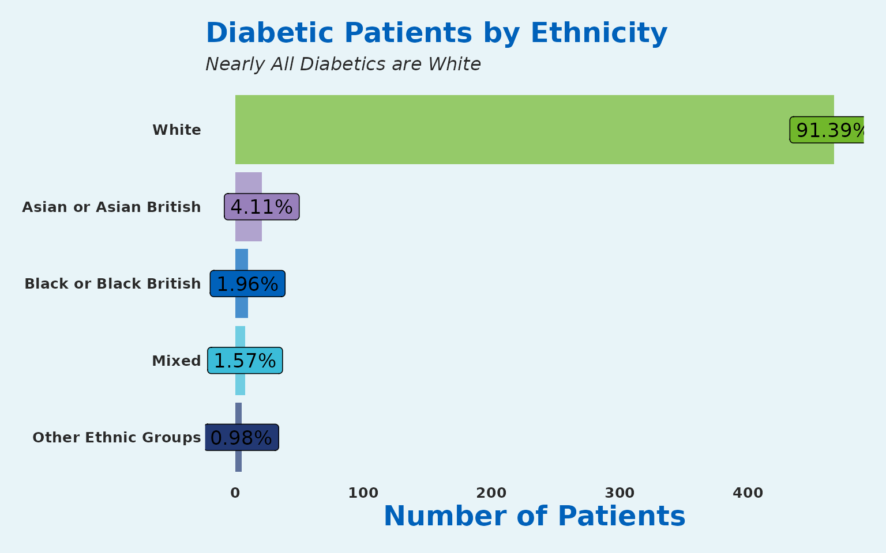
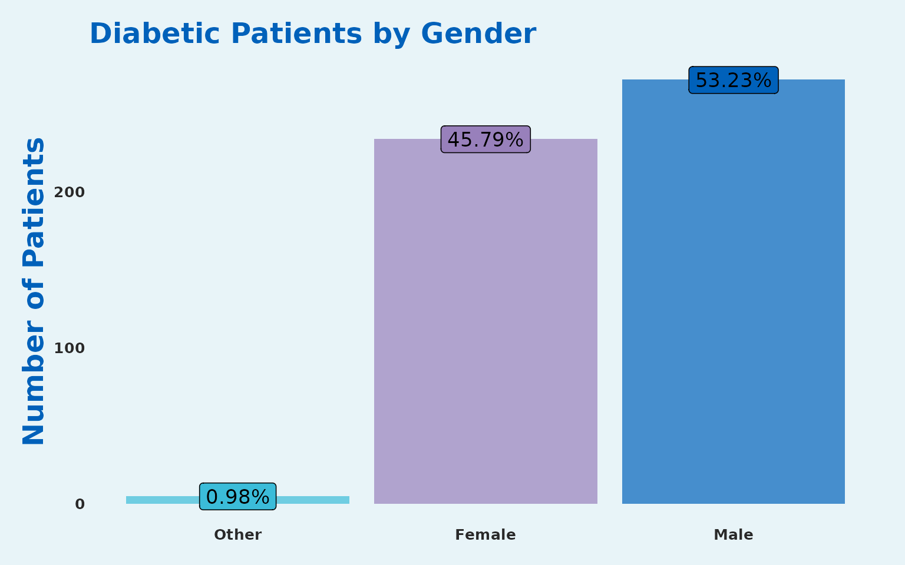
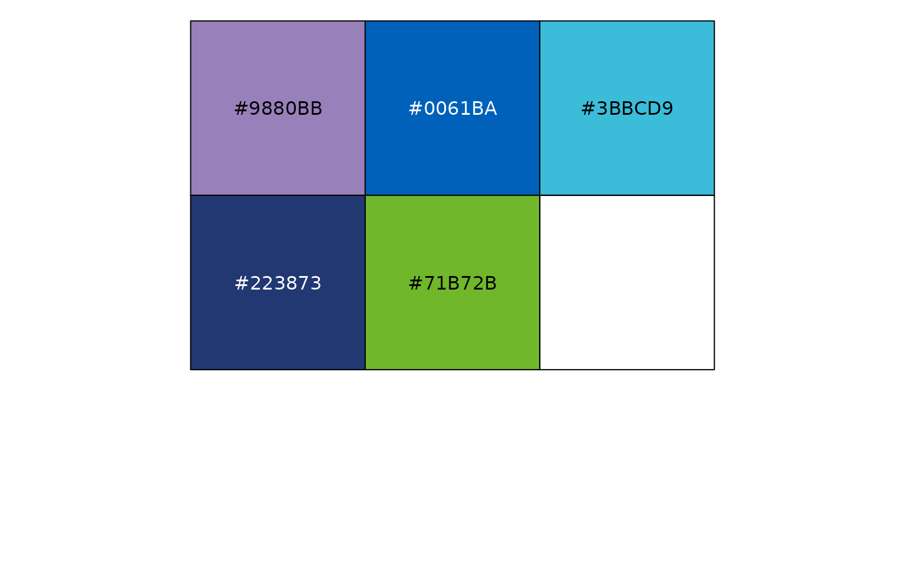
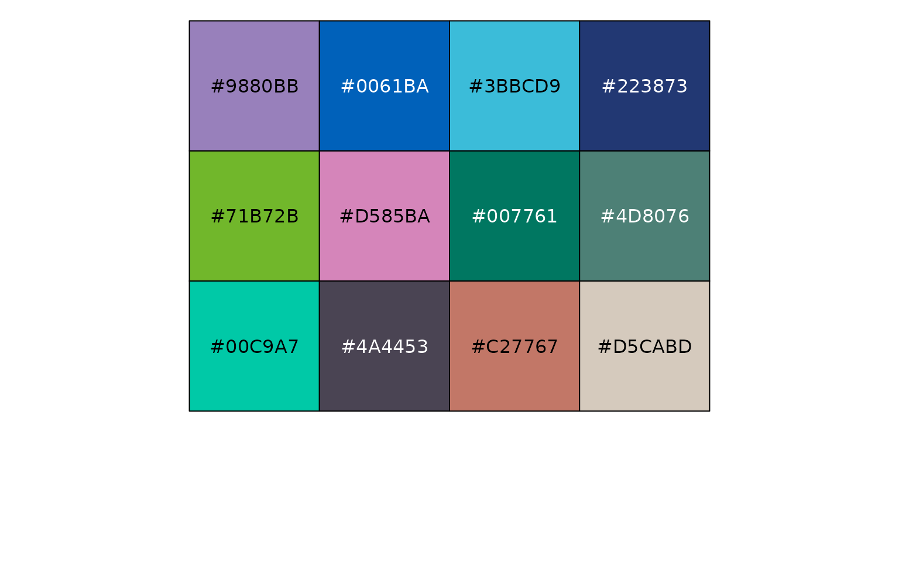

# SangerTools Vignette


## Welcome to the SangerTools package

This package has been created to provide convenient functions for
working with population health data. It is specifically aimed at
healthcare providers and services that focus on population health
management.

Many of the functions are centered around the Master Patient Index
format. Where each row is a patient and each column is an observation of
that patient.

In the next sections we will take you through how you use the tool. ****

### Loading in Health Data

To load in the Master Patient Index attached to the SangerTools package
follow these steps:

``` r


health_data <- SangerTools::master_patient_index
```

| Sex | Smoker | Diabetes | Dementia | Obesity | Age | IMD_Decile | Ethnicity | Locality | PrimaryCareNetwork |
|:---|---:|---:|---:|---:|---:|---:|:---|:---|:---|
| Female | 1 | 0 | 0 | 0 | 17 | 7 | White | Gloucester City | Tewkesbury, Newent and Staunton and West Cheltenham Medical |
| Female | 0 | 0 | 0 | 0 | 31 | 1 | White | Stroud and Berkeley Vale | North Cotswolds |
| Male | 0 | 0 | 0 | 0 | 34 | 3 | White | Cheltenham | The Forest of Dean |
| Female | 0 | 0 | 0 | 0 | 62 | 9 | White | Gloucester City | Rosebank & Bartongate |
| Female | 0 | 0 | 0 | 0 | 37 | 4 | White | Cheltenham | South Cotswolds |
| Female | 0 | 0 | 0 | 0 | 57 | 9 | White | Cheltenham | Cheltenham Central |

The data contains:

- **PseudoNHSNumber** - A Pseudonymised NHS Patient Identifier
- **Sex** - The identifiable sex of the patient
- **Smoker** - Health Condition Flag: 1 denotes if the patient is a
  smoker
- **Diabetes** - Health Condition Flag: 1 denotes if the patient has
  diabetes
- **Dementia** - Health Condition Flag: 1 denotes if the patient has
  dementia
- **Obesity** - Health Condition Flag: 1 denotes if the patient is Obese
- **Age** - Age of the patient
- **IMD_Decile** - The decile of indices of multiple deprivation
- **Ethnicity** - The identifiable ethnicity of the patient}
- **Locality** - The region where the patient lives - sampled from
  Gloucestershire Clinical Commissioning Group (GCCG)
- **PrimaryCareNetwork** - The network of General Practioners that the
  patient is registered with - sampled from (GCCG)

With the data we can start to work with the function in the package.

------------------------------------------------------------------------

### Age bands

It is common practice to transform continuous age values into a smaller
set of categories.

There are two functions in the package for doing this.

- `age_bandizer`
- `age_bandizer2`

`age_bandizer` Uses a tidyverse philosophy of function creation with
Non-Standard Evaluation. It will produce a new column with 5 year age
bands as a factor.

`age_bandizer2` uses Standard Evaluation and currently takes in puts of
band size 2,5,10 & 20.

``` r

health_data <- SangerTools::age_bandizer(df = health_data,
                                         Age_col = Age)

health_data <- SangerTools::age_bandizer_2(df = health_data,
                                           Age_col = "Age",
                                           Age_band_size = 5)
```

| Age | Ageband |
|----:|:--------|
|  17 | 15-19   |
|  31 | 30-34   |
|  34 | 30-34   |
|  62 | 60-64   |
|  37 | 35-39   |
|  57 | 55-59   |

### Generating a categorical column chart easily

The package makes it very simple to create a categorical column chart.
This will be implemented in the next example:

``` r

# Group by Ethnicity
diabetes_df <- health_data %>% 
  dplyr::filter(Diabetes==1)
  
  SangerTools::categorical_col_chart(df = diabetes_df,
                                     grouping_var = Ethnicity)+
  scale_fill_sanger()+ 
  labs(title = "Diabetic Patients by Ethnicity",
       subtitle = "Nearly All Diabetics are White",
       x = NULL, 
       y = "Number of Patients") + 
  coord_flip() 
```



``` r


# Group by Sex
health_data %>% 
  dplyr::filter(Diabetes==1) %>% 
  SangerTools::categorical_col_chart(Sex) + 
  scale_fill_sanger()+
  labs(title = "Diabetic Patients by Gender",
       x = NULL, 
       y = "Number of Patients")  
```



It really is that simple to generate very nice looking proportional
charts.

### Crude Prevalence

Here we will look at the crude rate of diabetes To obtain the crude
prevalence rate, this can be achieved below:

``` r

 crude_prevalence <- SangerTools::crude_rates(df = health_data,
                                              Condition =  Diabetes, 
                                              Locality)
#> Joining with `by = join_by(Locality)`
```

| Locality | Cohort_Size | Diabetes_Population | Prevalence_1k |
|:---|---:|---:|---:|
| The Forest of Dean | 941 | 54 | 57.38576 |
| Gloucester City | 2683 | 149 | 55.53485 |
| Cheltenham | 2524 | 137 | 54.27892 |
| North Cotswolds | 464 | 23 | 49.56897 |
| Stroud and Berkeley Vale | 1841 | 91 | 49.42966 |
| Tewkesbury Newent and Staunton | 649 | 24 | 36.97997 |
| South Cotswolds | 898 | 33 | 36.74833 |

### Age Standardised Rates

Let’s revisit the example above. Diabetes is highly confounded by age.
Most diabetics will be diagnosed after the age of 40.

``` r


asr_prevalence <- SangerTools::standardised_rates_df(df = health_data,
                                   Split_by = Locality,
                                   Condition = Diabetes, 
                                   Population_Standard = NULL,
                                   Granular = FALSE,
                                   Ageband )
#> Joining with `by = join_by(Locality, Ageband)`
#> Joining with `by = join_by(Ageband)`
```

| Locality                       | Standardised_Rate_1k |
|:-------------------------------|---------------------:|
| The Forest of Dean             |             57.04463 |
| Gloucester City                |             55.68534 |
| Cheltenham                     |             53.97917 |
| Stroud and Berkeley Vale       |             49.30150 |
| North Cotswolds                |             47.64903 |
| South Cotswolds                |             36.60576 |
| Tewkesbury Newent and Staunton |             35.37544 |

Given that each of the Localities now has the population structure of
the county as whole; we can see slight differences to the crude
prevalence rates.

### Age Standardised Rates with User Defined Population Structure

We will use another dataset attached to the package; the UK population
from the year 2018. This is broken down by 5 year age bands. For a user
define population structure to integrate with `standardised_rates_df`
ensure to change the name of the population column to `Pop_Weight`

### Load 2018 UK Population Structure

``` r


uk_pop18<- SangerTools::uk_pop_standard

names(uk_pop18) <- c("Pop_Weight","Ageband")
```

| Pop_Weight | Ageband |
|-----------:|:--------|
|  3,914,000 | 0-4     |
|  4,139,000 | 5-9     |
|  3,859,000 | 10-14   |
|  3,669,000 | 15-19   |
|  4,185,000 | 20-24   |
|  4,527,000 | 25-29   |

### UK Age Standardised Diabetes Prevalence

``` r

asr_uk <- SangerTools::standardised_rates_df(df = health_data,
                                   Split_by = Locality,
                                   Condition = Diabetes, 
                                   Population_Standard = uk_pop18,
                                   Granular = FALSE,
                                   Ageband )
#> Joining with `by = join_by(Locality, Ageband)`
#> Joining with `by = join_by(Ageband)`
```

| Locality                       | Standardised_Rate_1k |
|:-------------------------------|---------------------:|
| The Forest of Dean             |             49.58949 |
| Gloucester City                |             49.57563 |
| South Cotswolds                |             47.70326 |
| Cheltenham                     |             47.67118 |
| North Cotswolds                |             42.12233 |
| Stroud and Berkeley Vale       |             41.66005 |
| Tewkesbury Newent and Staunton |             30.12367 |

### Combining Results

To view both crude and standardised rates we can use dplyr::`left_join`

``` r

combined_rates <- crude_prevalence %>% 
  dplyr::left_join(asr_prevalence, by = c("Locality"))
```

| Locality | Cohort_Size | Diabetes_Population | Prevalence_1k | Standardised_Rate_1k |
|:---|---:|---:|---:|---:|
| The Forest of Dean | 941 | 54 | 57.38576 | 57.04463 |
| Gloucester City | 2683 | 149 | 55.53485 | 55.68534 |
| Cheltenham | 2524 | 137 | 54.27892 | 53.97917 |
| North Cotswolds | 464 | 23 | 49.56897 | 47.64903 |
| Stroud and Berkeley Vale | 1841 | 91 | 49.42966 | 49.30150 |
| Tewkesbury Newent and Staunton | 649 | 24 | 36.97997 | 35.37544 |
| South Cotswolds | 898 | 33 | 36.74833 | 36.60576 |

Other functionality added into the package would be to use the multiple
CSV reader and clipboard functions.

### Excel Clipboard function

This copies a data frame to the clipboard for you for then pasting into
Excel sheets, or csvs, or raw text.

``` r


SangerTools::excel_clip(combined_rates)
```

There is the potential to read from multiple CSVs as well and then these
can be fed into data frames.

### Multiple CSV reader

To implement this function you would need to have a number of CSVs
contained in a folder. To read these in, follow the below instructions:

``` r

file_path = 'my_file_path_where_csvs_are_stored'

if (length(SangerTools::multiple_csv_reader(file_path))==0){
  message("This won't work without changing the variable input to a local file path with CSVs in")
}
#> This won't work without changing the variable input to a local file path with CSVs in
```

`multiple_excel_reader` is the equivalent for excel files; however
please read function documentation page as both functions have a strict
set of requirements for execute.

### Splitting Dataframes and Saving

`split_and_save` is a quick way to split a dataframe on a specified
column into subsequent dataframes after which each of dataframes is
dynamically written to a location choice

``` r

SangerTools::split_and_save(
 df = health_data,
 Split_by = "Locality",
 file_path = "Inputs/",
 prefix = NULL
)
```

### Results to SQL

Write your results to SQL Server ensuring that the table name appears as
expected.

This function makes a number of assumptions and is limited in scope;
please read documentation.

``` r

SangerTools::df_to_sql(df = combined_rates,
                       driver = "SQL SERVER",
                       server = "Org-sql-db",
                       database = "MyReports",
                       sql_table_name = "Diabetes_Prevalence",
                       overwrite = FALSE)
```

### See Brand Colours

This is an anonymous function and can be called without any arguments

``` r


show_brand_palette()
```



    #> [1] "#9880BB" "#0061BA" "#3BBCD9" "#223873" "#71B72B"

### See More Colours

This is also an anonymous function; it will show an extended colour
palette

``` r

show_extended_palette()
```



    #>  [1] "#9880BB" "#0061BA" "#3BBCD9" "#223873" "#71B72B" "#D585BA" "#007761"
    #>  [8] "#4D8076" "#00C9A7" "#4A4453" "#C27767" "#D5CABD"

### Closing

More functions are being added to this tool and a new version of the
file will be released on CRAN very soon. Keep an eye out on the
associated [GitHub](https://github.com/ald0405/SangerTools) for updates.
