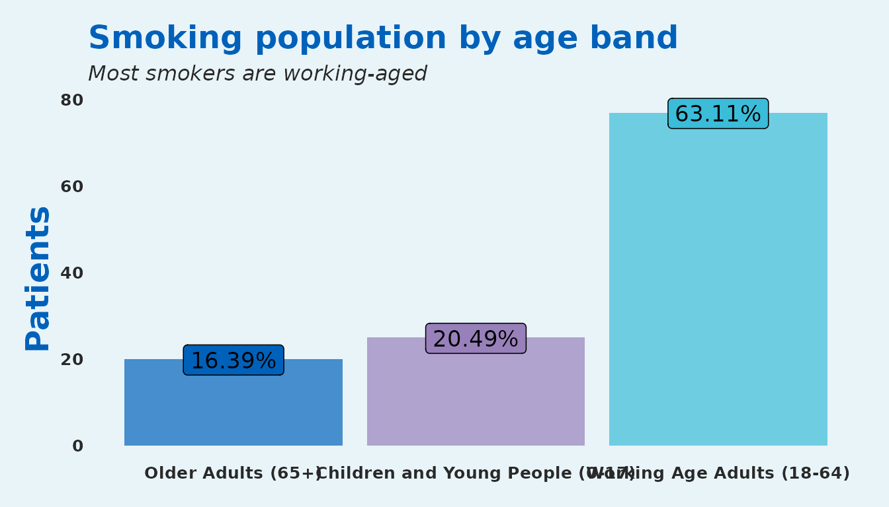
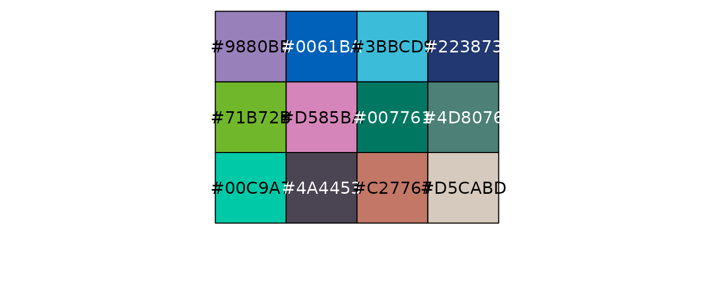
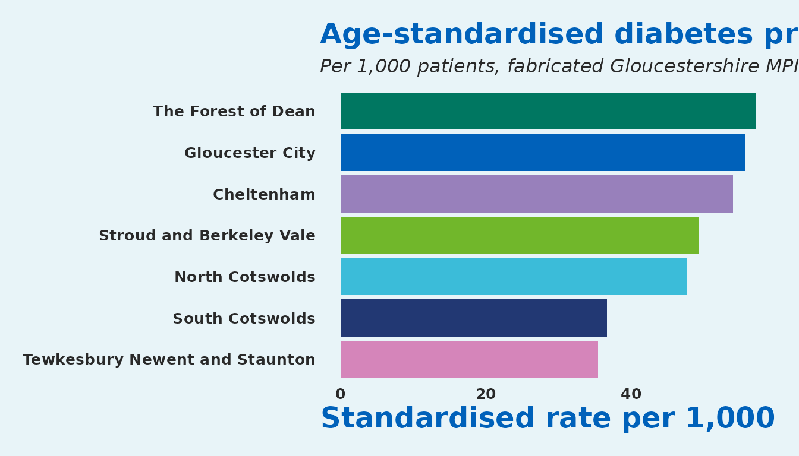

# Demo: Data and Functions

``` r

library(SangerTools)
library(dplyr)
library(ggplot2)
```

This vignette is a single-page tour of **SangerTools**: every bundled
dataset, every exported function, and a short end-to-end mini-case that
chains them together. If you have just installed the package and want to
confirm everything works, run this notebook top to bottom.

## Bundled datasets

SangerTools ships three fabricated population health datasets so every
example in the package is reproducible without external files.

### `PopHealthData`

A small (1,000 rows) NHS-style population dataset with one row per
patient.

``` r

data("PopHealthData", package = "SangerTools")
glimpse(PopHealthData)
#> Rows: 1,000
#> Columns: 8
#> $ Sex                <chr> "Male", "Female", "Male", "Male", "Male", "Female",…
#> $ Smoker             <dbl> 0, 0, 0, 0, 0, 0, 1, 0, 0, 0, 0, 0, 0, 0, 0, 0, 0, …
#> $ Diabetes           <dbl> 0, 0, 0, 0, 1, 1, 0, 0, 0, 0, 0, 1, 0, 0, 0, 0, 0, …
#> $ AgeBand            <chr> "Children and Young People (0-17)", "Working Age Ad…
#> $ IMD_Decile         <dbl> 9, 5, 3, 3, 4, 6, 3, 7, 6, 4, 9, 2, 1, 9, 2, 3, 4, …
#> $ Ethnicity          <chr> "White", "White", "White", "White", "White", "White…
#> $ Locality           <chr> "Cheltenham", "Gloucester City", "Cheltenham", "Glo…
#> $ PrimaryCareNetwork <chr> "Cheltenham Central", "Tewkesbury, Newent and Staun…
head(PopHealthData)
#> # A tibble: 6 × 8
#>   Sex   Smoker Diabetes AgeBand IMD_Decile Ethnicity Locality PrimaryCareNetwork
#>   <chr>  <dbl>    <dbl> <chr>        <dbl> <chr>     <chr>    <chr>             
#> 1 Male       0        0 Childr…          9 White     Chelten… Cheltenham Central
#> 2 Fema…      0        0 Workin…          5 White     Glouces… Tewkesbury, Newen…
#> 3 Male       0        0 Workin…          3 White     Chelten… Severn Health     
#> 4 Male       0        0 Workin…          3 White     Glouces… Cheltenham Central
#> 5 Male       0        1 Older …          4 White     Chelten… Cheltenham Periph…
#> 6 Fema…      0        1 Workin…          6 White     North C… Cheltenham Central
```

### `master_patient_index`

A larger (10,000 rows) fabricated Master Patient Index inspired by
Gloucestershire’s population. Includes a numeric `Age` column suitable
for banding.

``` r

data("master_patient_index", package = "SangerTools")
glimpse(master_patient_index)
#> Rows: 10,000
#> Columns: 10
#> $ Sex                <chr> "Female", "Female", "Male", "Female", "Female", "Fe…
#> $ Smoker             <dbl> 1, 0, 0, 0, 0, 0, 0, 0, 0, 0, 0, 0, 1, 0, 0, 0, 1, …
#> $ Diabetes           <dbl> 0, 0, 0, 0, 0, 0, 0, 0, 0, 0, 0, 0, 0, 0, 0, 0, 1, …
#> $ Dementia           <dbl> 0, 0, 0, 0, 0, 0, 0, 0, 0, 0, 0, 0, 0, 0, 0, 0, 0, …
#> $ Obesity            <dbl> 0, 0, 0, 0, 0, 0, 0, 0, 0, 0, 1, 0, 0, 1, 0, 0, 0, …
#> $ Age                <dbl> 17, 31, 34, 62, 37, 57, 25, 14, 30, 64, 45, 70, 11,…
#> $ IMD_Decile         <dbl> 7, 1, 3, 9, 4, 9, 2, 3, 3, 1, 4, 10, 3, 4, 6, 3, 4,…
#> $ Ethnicity          <chr> "White", "White", "White", "White", "White", "White…
#> $ Locality           <chr> "Gloucester City", "Stroud and Berkeley Vale", "Che…
#> $ PrimaryCareNetwork <chr> "Tewkesbury, Newent and Staunton and West Cheltenha…
```

### `uk_pop_standard`

A 5-year age band weighting taken from ONS 2018 mid-year population
estimates, ready to use as a standard population for direct
standardisation.

``` r

data("uk_pop_standard", package = "SangerTools")
uk_pop_standard
#> # A tibble: 21 × 2
#>    UK_Population Ageband
#>            <dbl> <fct>  
#>  1       3914000 0-4    
#>  2       4139000 5-9    
#>  3       3859000 10-14  
#>  4       3669000 15-19  
#>  5       4185000 20-24  
#>  6       4527000 25-29  
#>  7       4463000 30-34  
#>  8       4372000 35-39  
#>  9       3993000 40-44  
#> 10       4507000 45-49  
#> # ℹ 11 more rows
```

## Function gallery

### Wrangling

#### `age_bandizer()` — fixed 5-year bands

``` r

mpi_banded <- age_bandizer(master_patient_index, Age)
mpi_banded %>%
  count(Ageband) %>%
  head()
#> # A tibble: 6 × 2
#>   Ageband     n
#>   <fct>   <int>
#> 1 0-4       335
#> 2 5-9       564
#> 3 10-14     597
#> 4 15-19     550
#> 5 20-24     509
#> 6 25-29     596
```

#### `age_bandizer_2()` — configurable band width

``` r

ages <- data.frame(Age = sample(0:100, 30, replace = TRUE))
age_bandizer_2(ages, Age_col = "Age", Age_band_size = 10) %>% head()
#>   Age Ageband
#> 1  44   40-49
#> 2  22   20-29
#> 3  75   70-79
#> 4  62   60-69
#> 5 100    100+
#> 6  46   40-49
```

#### `cohort_processing()` and `split_and_save()`

Both split a data frame by an organisational identifier and write one
CSV per group. They are file-system side-effects, so we show the
signatures here and run them in a temp directory below.

``` r

cohort_processing(
  df = PopHealthData,
  Split_by = "Locality",
  path = "outputs/"
)

split_and_save(
  df = PopHealthData,
  Split_by = "Locality",
  path = "outputs/",
  prefix = "Locality_"
)
```

A quick live demo that cleans up after itself:

``` r

tmp <- file.path(tempdir(), "sanger-demo")
dir.create(tmp, showWarnings = FALSE, recursive = TRUE)
split_and_save(
  df = PopHealthData,
  Split_by = "Locality",
  path = paste0(tmp, "/"),
  prefix = "Locality_"
)
#> $Cheltenham
#> # A tibble: 249 × 8
#>    Sex    Smoker Diabetes AgeBand                  IMD_Decile Ethnicity Locality
#>    <chr>   <dbl>    <dbl> <chr>                         <dbl> <chr>     <chr>   
#>  1 Male        0        0 Children and Young Peop…          9 White     Chelten…
#>  2 Male        0        0 Working Age Adults (18-…          3 White     Chelten…
#>  3 Male        0        1 Older Adults (65+)                4 White     Chelten…
#>  4 Female      1        0 Working Age Adults (18-…          3 White     Chelten…
#>  5 Female      0        0 Working Age Adults (18-…          2 White     Chelten…
#>  6 Male        0        0 Children and Young Peop…          3 White     Chelten…
#>  7 Male        0        0 Working Age Adults (18-…          5 White     Chelten…
#>  8 Male        0        0 Older Adults (65+)                6 Black or… Chelten…
#>  9 Male        0        0 Working Age Adults (18-…          1 White     Chelten…
#> 10 Female      0        0 Children and Young Peop…         10 White     Chelten…
#> # ℹ 239 more rows
#> # ℹ 1 more variable: PrimaryCareNetwork <chr>
#> 
#> $`Gloucester City`
#> # A tibble: 272 × 8
#>    Sex    Smoker Diabetes AgeBand                  IMD_Decile Ethnicity Locality
#>    <chr>   <dbl>    <dbl> <chr>                         <dbl> <chr>     <chr>   
#>  1 Female      0        0 Working Age Adults (18-…          5 White     Glouces…
#>  2 Male        0        0 Working Age Adults (18-…          3 White     Glouces…
#>  3 Male        0        1 Working Age Adults (18-…          2 White     Glouces…
#>  4 Female      0        0 Working Age Adults (18-…          4 White     Glouces…
#>  5 Female      0        0 Working Age Adults (18-…          9 White     Glouces…
#>  6 Female      0        0 Older Adults (65+)                4 White     Glouces…
#>  7 Male        0        1 Children and Young Peop…          4 White     Glouces…
#>  8 Male        0        0 Children and Young Peop…          1 White     Glouces…
#>  9 Male        0        0 Older Adults (65+)                7 White     Glouces…
#> 10 Other       0        0 Older Adults (65+)                2 White     Glouces…
#> # ℹ 262 more rows
#> # ℹ 1 more variable: PrimaryCareNetwork <chr>
#> 
#> $`North Cotswolds`
#> # A tibble: 49 × 8
#>    Sex    Smoker Diabetes AgeBand                  IMD_Decile Ethnicity Locality
#>    <chr>   <dbl>    <dbl> <chr>                         <dbl> <chr>     <chr>   
#>  1 Female      0        1 Working Age Adults (18-…          6 White     North C…
#>  2 Male        0        0 Working Age Adults (18-…          1 White     North C…
#>  3 Male        1        0 Working Age Adults (18-…          4 White     North C…
#>  4 Female      0        0 Working Age Adults (18-…          6 White     North C…
#>  5 Male        0        0 Children and Young Peop…          4 White     North C…
#>  6 Female      0        0 Working Age Adults (18-…          5 White     North C…
#>  7 Female      0        0 Working Age Adults (18-…          5 White     North C…
#>  8 Male        0        0 Working Age Adults (18-…          1 Asian or… North C…
#>  9 Male        0        0 Working Age Adults (18-…         10 White     North C…
#> 10 Female      0        0 Working Age Adults (18-…          3 Black or… North C…
#> # ℹ 39 more rows
#> # ℹ 1 more variable: PrimaryCareNetwork <chr>
#> 
#> $`South Cotswolds`
#> # A tibble: 98 × 8
#>    Sex    Smoker Diabetes AgeBand                  IMD_Decile Ethnicity Locality
#>    <chr>   <dbl>    <dbl> <chr>                         <dbl> <chr>     <chr>   
#>  1 Female      0        0 Older Adults (65+)                4 Black or… South C…
#>  2 Male        0        0 Working Age Adults (18-…          1 White     South C…
#>  3 Male        0        0 Older Adults (65+)                5 White     South C…
#>  4 Male        0        0 Working Age Adults (18-…          8 White     South C…
#>  5 Female      1        0 Children and Young Peop…         10 White     South C…
#>  6 Male        0        0 Working Age Adults (18-…          5 White     South C…
#>  7 Male        0        0 Older Adults (65+)               10 White     South C…
#>  8 Male        0        0 Working Age Adults (18-…          3 White     South C…
#>  9 Male        0        0 Working Age Adults (18-…          2 White     South C…
#> 10 Female      0        0 Working Age Adults (18-…          4 White     South C…
#> # ℹ 88 more rows
#> # ℹ 1 more variable: PrimaryCareNetwork <chr>
#> 
#> $`Stroud and Berkeley Vale`
#> # A tibble: 187 × 8
#>    Sex    Smoker Diabetes AgeBand                  IMD_Decile Ethnicity Locality
#>    <chr>   <dbl>    <dbl> <chr>                         <dbl> <chr>     <chr>   
#>  1 Female      0        0 Working Age Adults (18-…          9 White     Stroud …
#>  2 Male        0        0 Working Age Adults (18-…          9 White     Stroud …
#>  3 Male        0        0 Children and Young Peop…          3 Asian or… Stroud …
#>  4 Female      0        0 Working Age Adults (18-…          2 White     Stroud …
#>  5 Female      0        0 Working Age Adults (18-…          2 White     Stroud …
#>  6 Female      0        0 Older Adults (65+)                4 White     Stroud …
#>  7 Female      0        0 Working Age Adults (18-…          3 White     Stroud …
#>  8 Male        0        0 Working Age Adults (18-…         10 White     Stroud …
#>  9 Male        0        0 Older Adults (65+)                9 White     Stroud …
#> 10 Male        1        0 Working Age Adults (18-…          1 White     Stroud …
#> # ℹ 177 more rows
#> # ℹ 1 more variable: PrimaryCareNetwork <chr>
#> 
#> $`Tewkesbury Newent and Staunton`
#> # A tibble: 64 × 8
#>    Sex    Smoker Diabetes AgeBand                  IMD_Decile Ethnicity Locality
#>    <chr>   <dbl>    <dbl> <chr>                         <dbl> <chr>     <chr>   
#>  1 Female      0        0 Working Age Adults (18-…          5 White     Tewkesb…
#>  2 Female      0        0 Children and Young Peop…          4 White     Tewkesb…
#>  3 Female      0        0 Older Adults (65+)                5 White     Tewkesb…
#>  4 Male        0        0 Older Adults (65+)                9 White     Tewkesb…
#>  5 Female      0        0 Older Adults (65+)                6 White     Tewkesb…
#>  6 Male        0        0 Working Age Adults (18-…          2 White     Tewkesb…
#>  7 Female      1        0 Working Age Adults (18-…          8 White     Tewkesb…
#>  8 Male        0        0 Working Age Adults (18-…          8 White     Tewkesb…
#>  9 Male        1        0 Working Age Adults (18-…          2 Other Et… Tewkesb…
#> 10 Female      0        0 Older Adults (65+)                9 White     Tewkesb…
#> # ℹ 54 more rows
#> # ℹ 1 more variable: PrimaryCareNetwork <chr>
#> 
#> $`The Forest of Dean`
#> # A tibble: 81 × 8
#>    Sex    Smoker Diabetes AgeBand                  IMD_Decile Ethnicity Locality
#>    <chr>   <dbl>    <dbl> <chr>                         <dbl> <chr>     <chr>   
#>  1 Male        0        0 Working Age Adults (18-…          7 White     The For…
#>  2 Female      0        0 Older Adults (65+)                6 Mixed     The For…
#>  3 Male        0        0 Children and Young Peop…          8 White     The For…
#>  4 Female      0        0 Working Age Adults (18-…          9 White     The For…
#>  5 Male        0        0 Children and Young Peop…          6 White     The For…
#>  6 Female      0        0 Older Adults (65+)                2 White     The For…
#>  7 Male        0        0 Working Age Adults (18-…          1 White     The For…
#>  8 Male        0        0 Children and Young Peop…          5 White     The For…
#>  9 Female      0        0 Older Adults (65+)                8 White     The For…
#> 10 Male        0        0 Older Adults (65+)                6 White     The For…
#> # ℹ 71 more rows
#> # ℹ 1 more variable: PrimaryCareNetwork <chr>
list.files(tmp, pattern = "\\.csv$")
#> [1] "Locality_Cheltenham.csv"                    
#> [2] "Locality_Gloucester City.csv"               
#> [3] "Locality_North Cotswolds.csv"               
#> [4] "Locality_South Cotswolds.csv"               
#> [5] "Locality_Stroud and Berkeley Vale.csv"      
#> [6] "Locality_Tewkesbury Newent and Staunton.csv"
#> [7] "Locality_The Forest of Dean.csv"
unlink(tmp, recursive = TRUE)
```

### Analytics

#### `crude_rates()`

Crude prevalence per 1,000 patients, grouped by one or more variables.

``` r

crude_rates(PopHealthData, Diabetes, Locality)
#> # A tibble: 7 × 4
#>   Locality                       Cohort_Size Diabetes_Population Prevalence_1k
#>   <chr>                                <int>               <int>         <dbl>
#> 1 Cheltenham                             249                  15          60.2
#> 2 Gloucester City                        272                  15          55.1
#> 3 South Cotswolds                         98                   5          51.0
#> 4 The Forest of Dean                      81                   4          49.4
#> 5 Tewkesbury Newent and Staunton          64                   2          31.2
#> 6 Stroud and Berkeley Vale               187                   5          26.7
#> 7 North Cotswolds                         49                   1          20.4
```

#### `standardised_rates_df()`

Direct age-standardised prevalence using either the dataset’s own age
structure or a supplied population standard.

``` r

standardised_rates_df(
  df = mpi_banded,
  Split_by = Locality,
  Condition = Diabetes,
  Population_Standard = NULL,
  Granular = FALSE,
  Ageband
)
#> # A tibble: 7 × 2
#>   Locality                       Standardised_Rate_1k
#>   <chr>                                         <dbl>
#> 1 The Forest of Dean                             57.0
#> 2 Gloucester City                                55.7
#> 3 Cheltenham                                     54.0
#> 4 Stroud and Berkeley Vale                       49.3
#> 5 North Cotswolds                                47.6
#> 6 South Cotswolds                                36.6
#> 7 Tewkesbury Newent and Staunton                 35.4
```

### Charts and theming

#### `categorical_col_chart()` + `theme_sanger()` + `scale_fill_sanger()`

``` r

PopHealthData %>%
  filter(Smoker == 1) %>%
  categorical_col_chart(AgeBand) +
  labs(
    title    = "Smoking population by age band",
    subtitle = "Most smokers are working-aged",
    x = NULL,
    y = "Patients"
  ) +
  scale_fill_sanger()
```



#### Palette previews

``` r

show_brand_palette()
```


    #> [1] "#9880BB" "#0061BA" "#3BBCD9" "#223873" "#71B72B"
    show_extended_palette()



    #>  [1] "#9880BB" "#0061BA" "#3BBCD9" "#223873" "#71B72B" "#D585BA" "#007761"
    #>  [8] "#4D8076" "#00C9A7" "#4A4453" "#C27767" "#D5CABD"

### I/O

#### `excel_clip()`

Copies a data frame to the system clipboard in a tab-separated layout
that pastes cleanly into Excel. Windows only (it uses the `"clipboard"`
device); skipped in this vignette.

``` r

excel_clip(PopHealthData)
```

#### `df_to_sql()`

Writes a data frame to a Microsoft SQL Server table via ODBC. Requires a
configured DSN and a Windows machine with integrated authentication; not
runnable in a vignette build.

``` r

df_to_sql(
  df             = PopHealthData,
  driver         = "ODBC Driver 17 for SQL Server",
  server         = "your-server",
  database       = "your-database",
  sql_table_name = "PopHealthData",
  overwrite      = FALSE
)
```

#### `multiple_csv_reader()` / `multiple_excel_reader()`

Aggregate a directory of CSVs or Excel files into one tidy frame.
Pointed at an empty directory below to keep the vignette hermetic.

``` r

empty <- file.path(tempdir(), "no-files")
dir.create(empty, showWarnings = FALSE)
multiple_csv_reader(paste0(empty, "/"))
#> NULL
unlink(empty, recursive = TRUE)
```

## Putting it together

A short end-to-end mini case: take the Master Patient Index, band ages,
compute age-standardised diabetes prevalence by locality using the ONS
UK standard population, and plot the result with the Sanger theme.

``` r

banded <- age_bandizer(master_patient_index, Age)

rates <- standardised_rates_df(
  df = banded,
  Split_by = Locality,
  Condition = Diabetes,
  Population_Standard = NULL,
  Granular = FALSE,
  Ageband
)

rates
#> # A tibble: 7 × 2
#>   Locality                       Standardised_Rate_1k
#>   <chr>                                         <dbl>
#> 1 The Forest of Dean                             57.0
#> 2 Gloucester City                                55.7
#> 3 Cheltenham                                     54.0
#> 4 Stroud and Berkeley Vale                       49.3
#> 5 North Cotswolds                                47.6
#> 6 South Cotswolds                                36.6
#> 7 Tewkesbury Newent and Staunton                 35.4

ggplot(rates, aes(x = reorder(Locality, Standardised_Rate_1k),
                  y = Standardised_Rate_1k,
                  fill = Locality)) +
  geom_col(show.legend = FALSE) +
  coord_flip() +
  labs(
    title    = "Age-standardised diabetes prevalence",
    subtitle = "Per 1,000 patients, fabricated Gloucestershire MPI",
    x = NULL,
    y = "Standardised rate per 1,000"
  ) +
  theme_sanger() +
  scale_fill_sanger()
```


